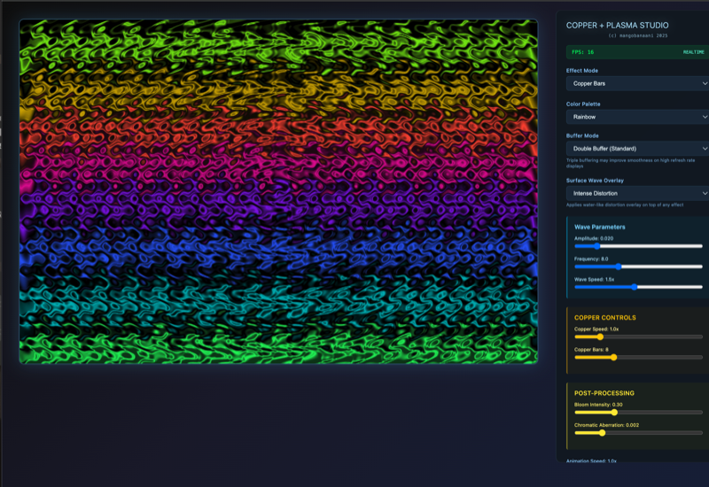
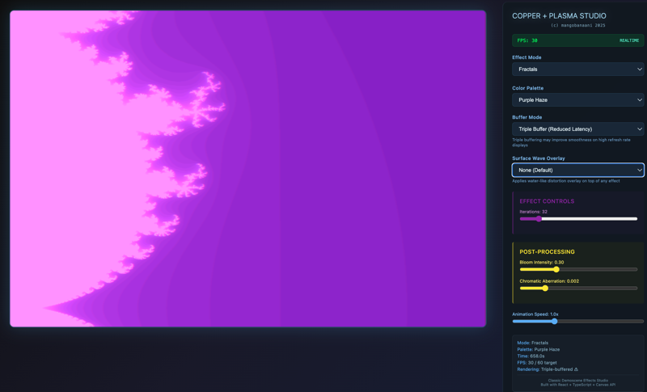

# Copper Plasma - Classic Demoscene Effects Studio

A modern React-based recreation of classic Amiga demoscene effects, featuring real-time parameter control and authentic visual aesthetics.

## Overview

Copper Plasma is a comprehensive demoscene effects studio that brings the nostalgic charm of 1980s and 1990s computer graphics to the modern web. Built with React, TypeScript, and optimized Canvas rendering, it delivers fairly ok fps animations while maintaining the authentic look and feel of classic Amiga demos.

## Features

### Visual Effects
- **Plasma Fields** - Mathematical plasma generation with sine wave interference
- **Copper Bars** - Classic horizontal scanline effects with color gradients
- **Tunnel Effect** - 3D perspective tunnel with texture mapping
- **Metaballs** - Organic blob rendering with distance field calculations
- **Rotozoomer** - Rotating and scaling pattern effects
- **Fire Simulation** - Realistic flame particle effects
- **Water Ripples** - Dynamic water surface simulation
- **Fractals** - Mathematical fractal generation and visualization
- **Starfield** - 3D starfield with depth and motion
- **Twister** - Spiral distortion effects
- **Grid Patterns** - Geometric grid transformations
- **Noise Effects** - Procedural noise and texture generation
- **Combined Mode** - Layered effect combinations

### Technical Features
- **Real-time Performance Monitoring** - Live FPS counter with performance indicators
- **19 Classic Color Palettes** - Authentic Amiga-style color schemes
- **Post-processing Pipeline** - Bloom effects and chromatic aberration
- **Interactive Controls** - Real-time parameter adjustment for all effects
- **Optimized Rendering** - Double-buffered canvas with hardware acceleration
- **Responsive Design** - Modern glass morphism UI with professional styling

## Screenshots

### Plasma Effect with Surface Wave Overlay

*Classic plasma field generation with optional surface wave distortion overlay*

### Copper Bars and Combined Effects
  
*Authentic Amiga-style copper bars with multiple color palettes and effect combinations*

### Advanced Effects and Control Interface

*Professional control interface with real-time parameter adjustment, buffer mode selection, and performance monitoring*

## Technical Specifications

### Performance
- **Target Frame Rate**: 60 FPS
- **Canvas Resolution**: 1200x800 pixels
- **Rendering Method**: Double/Triple-buffered Canvas 2D API
- **Buffer Modes**: 
  - Double Buffer (Standard): Front buffer + back buffer for stable rendering
  - Triple Buffer (Optional): Additional work buffer for reduced input latency and smoother frame delivery on high refresh rate displays
- **Memory Management**: Optimized for continuous operation

### Browser Compatibility
- Chrome 90+
- Firefox 88+
- Safari 14+
- Edge 90+

### System Requirements
- Modern CPU with hardware acceleration
- Minimum 4GB RAM
- GPU with Canvas 2D acceleration support

## Installation and Setup

### Prerequisites
- Node.js 16.0 or higher
- npm or yarn package manager

### Quick Start

```bash
# Clone the repository
git clone https://github.com/mangobanaani/copperplasma.git

# Navigate to project directory
cd copperplasma

# Install dependencies
npm install

# Start development server
npm run dev

# Build for production
npm run build
```

### Development Commands

```bash
# Start development server with hot reload
npm run dev

# Type checking and build
npm run build

# Lint code
npm run lint

# Preview production build
npm run preview

# Type check without building
npm run type-check
```

## Deployment

### Vercel Deployment (Recommended)

This project is optimized for Vercel deployment with zero configuration needed.

#### Option 1: Deploy via Vercel CLI
```bash
# Install Vercel CLI globally
npm install -g vercel

# Deploy to Vercel
vercel

# For production deployment
vercel --prod
```

#### Option 2: Deploy via GitHub
1. Push your code to a GitHub repository
2. Visit [vercel.com](https://vercel.com)
3. Import your GitHub repository
4. Vercel will automatically detect it's a Vite project
5. Deploy with default settings

#### Option 3: Deploy via Git Integration
```bash
# Connect to Vercel and deploy
npx vercel

# Follow the prompts to link your project
# Vercel will automatically build and deploy
```

### Environment Variables (Optional)
Create a `.env.local` file based on `.env.example` for any configuration:
```bash
cp .env.example .env.local
```

### Build Optimization
The project includes several optimizations for production:
- **Terser minification** for smaller bundle sizes
- **Chunk splitting** for better caching
- **Asset optimization** with long-term caching headers
- **TypeScript compilation** with strict type checking

## Usage Guide

### Effect Selection
Use the effect dropdown to switch between different visual modes. Each effect has its own unique parameter controls that appear dynamically.

### Parameter Control
- **Speed**: Controls animation speed (0.1x to 3.0x)
- **Intensity**: Adjusts effect strength and amplitude
- **Scale**: Modifies pattern size and detail level
- **Color Palette**: Choose from 19 classic color schemes
- **Buffer Mode**: Select between double and triple buffering
  - Double Buffer: Standard mode, lower memory usage
  - Triple Buffer: Reduced input latency, smoother on 120Hz+ displays

### Post-processing
- **Bloom Intensity**: Adds glow effects (0-100%)
- **Chromatic Aberration**: RGB channel separation effect (0-100%)

### Performance Monitoring
The FPS counter shows real-time performance with visual indicators:
- Green checkmark: Optimal performance (>50 FPS)
- Warning symbol: Performance issues (<50 FPS)

## Architecture

### Core Components
- **Effect Engine**: Mathematical algorithms for each visual effect
- **Canvas Renderer**: Optimized 2D rendering pipeline
- **Parameter System**: Real-time control interface
- **Color Palette Manager**: Classic demoscene color schemes
- **Performance Monitor**: FPS tracking and optimization

### Code Structure
```
src/
├── App.tsx           # Main application component with embedded effects
├── main.tsx          # React application entry point
└── index.css         # Base styling
```

### Effect Implementation
Each effect is implemented as a pure function that renders to the canvas:
- Mathematical precision for authentic demoscene aesthetics
- Optimized for real-time performance
- Parameterized for interactive control

## Color Palettes

The studio includes 19 carefully crafted color palettes inspired by classic demoscene productions:

- **Classic Amiga** - Original Amiga color schemes
- **Copper Dream** - Warm metallic gradients
- **Ocean Deep** - Blue water themes
- **Fire Storm** - Red and orange flames
- **Electric Blue** - Neon blue effects
- **Sunset Blaze** - Orange and purple gradients
- **Forest Mystic** - Green nature themes
- **Purple Haze** - Purple and violet schemes
- **Golden Hour** - Warm yellow and orange
- **Arctic Ice** - Cool blue and white
- **Neon Nights** - Bright synthetic colors
- **Retro Wave** - 1980s aesthetic colors
- **Plasma Green** - Classic green CRT look
- **Cherry Bomb** - Red and pink themes
- **Cyber Punk** - Futuristic color schemes
- **Rainbow Prism** - Full spectrum gradients
- **Monochrome** - Black and white effects
- **Sepia Tone** - Vintage brown tones
- **Thermal Vision** - Heat map colors

## Performance Optimization

### Canvas Optimizations
- `alpha: false` - Disables alpha channel for better performance
- `desynchronized: true` - Enables low-latency rendering
- Double buffering prevents flickering (standard mode)
- Triple buffering reduces input lag and improves smoothness on high refresh rate displays
- Efficient pixel manipulation techniques
- Optional buffer mode selection for different performance characteristics

### Animation Optimizations
- RequestAnimationFrame for smooth timing
- Delta time calculations for consistent speed
- Conditional rendering based on frame rate
- Memory-efficient calculation methods

## Contributing

### Development Guidelines
- Use TypeScript for type safety
- Implement effects as pure functions
- Maintain 60fps performance target
- Follow authentic demoscene aesthetics
- Include parameter controls for new effects

### Adding New Effects
1. Implement effect function in the main component
2. Add parameter controls to the UI
3. Include effect in the mode selection
4. Test performance across different devices
5. Update documentation

## Technical Notes

### Mathematical Foundations
Effects use classic demoscene techniques:
- Distance field calculations for metaballs
- Polar coordinate transformations
- Sine wave interference patterns
- Fractal generation algorithms
- Texture mapping and perspective projection

### Browser Considerations
- Canvas 2D API limitations on mobile devices
- Memory usage patterns for continuous operation
- Hardware acceleration availability
- Touch interface adaptations

## License

© mangobanaani 2025

## Acknowledgments

Inspired by the classic Amiga demoscene and the creative programming community that pioneered these visual effects in the 1980s and 1990s.

---

*Built with React 19, TypeScript 5.8, and Vite 7 for modern web performance.*
